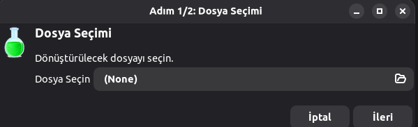
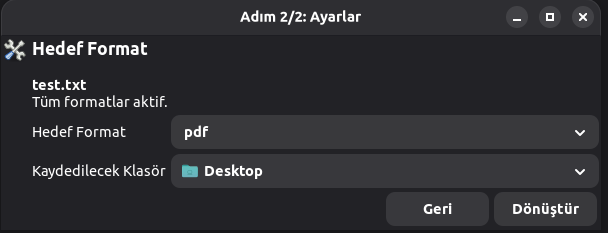
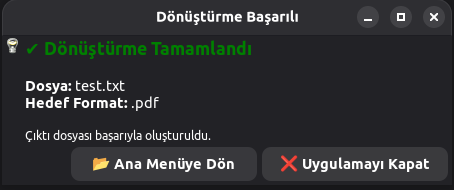
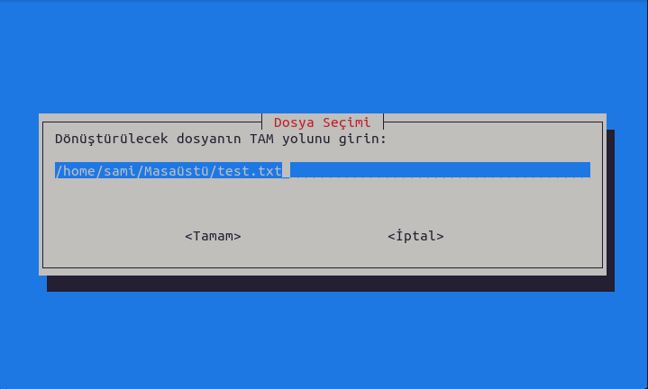
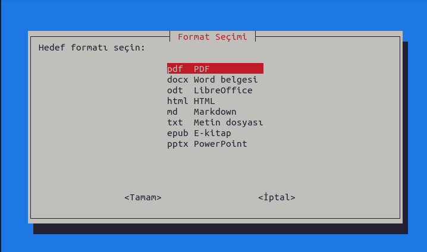
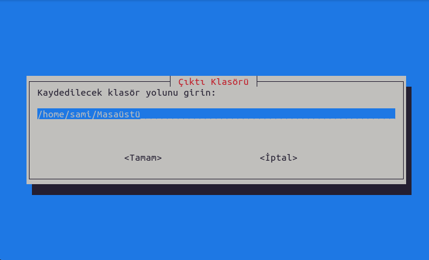
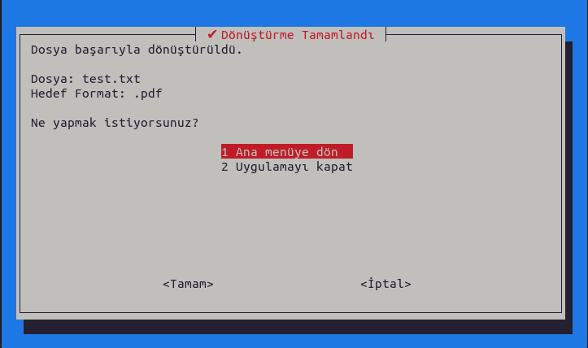

# 📄 Pandoc Dosya Dönüştürücü

GUI ve TUI Destekli Linux Projesi

[](https://www.gnu.org/software/bash/)
[](https://pandoc.org/)

## 📌 Proje Tanımı

Bu proje, **Pandoc** aracını kullanarak farklı belge formatları arasında dönüşüm yapabilen bir Linux tabanlı dosya dönüştürme uygulamasıdır. Uygulama hem **grafik arayüz (GUI)** hem de **terminal arayüzü (TUI)** desteği sunar.

Kullanıcı, dönüştürmek istediği dosyayı seçer, hedef formatı belirler ve çıktının kaydedileceği klasörü seçerek işlemi başlatır.

## ⚙️ Kullanılan Teknolojiler

- **Bash Script** - Ana programlama dili
- **Pandoc** - Belge dönüştürme motoru
- **YAD** - Grafik arayüz için
- **Whiptail** - Terminal arayüzü için

## 📁 Proje Dosya Yapısı

```
.
├── main.sh         # Ana giriş noktası
├── gui_mode.sh     # Grafik arayüz (YAD)
├── tui_mode.sh     # Terminal arayüzü (Whiptail)
├── functions.sh    # Ortak fonksiyonlar (dönüştürme işlemleri)
└── README.md
```

## 🚀 Kurulum

### Gereksinimler

Aşağıdaki araçların sisteminizde yüklü olması gerekmektedir:

```bash
sudo apt-get update
sudo apt-get install pandoc yad whiptail
```

### Çalıştırma İzni

Öncelikle script dosyalarına çalıştırma izni verin:

```bash
chmod +x *.sh
```

## ▶️ Kullanım

Uygulamayı başlatmak için:

```bash
./main.sh
```

## 🖥️ GUI Modu (YAD)

- ✅ Dosya seçimi grafik arayüzle yapılır
- ✅ Dosya uzantısına göre akıllı format listesi
- ✅ Dönüştürme sırasında yükleniyor/progress ekranı
- ✅ İşlem sonunda kullanıcı seçenekleri:
  - Ana menüye dön
  - Uygulamayı kapat
 
  

  *Dosya Seçme Ekranı*

  

  *Dosya Dönüştürme Ekranı*
  
  

  *Çıkış Ekranı*

## 💻 TUI Modu (Whiptail)

- ✅ Terminal üzerinden kullanıcı dostu menüler
- ✅ PDF ve diğer dosyalar için farklı format seçenekleri
- ✅ Hatalı giriş kontrolleri
- ✅ Dönüştürme sonrası kullanıcı seçimine bağlı akış


  

  *Giriş Ekranı*

  

  *Format Seçme Ekranı*

  

  *Dosya Oluşturma Ekranı*

  

  *Çıkış Ekranı*


## 🔁 Desteklenen Formatlar

| Format | Uzantı | Notlar |
|--------|---------|--------|
| PDF | `.pdf` | Sınırlı çıktı format desteği |
| Word | `.docx` | Tam destek |
| OpenDocument | `.odt` | Tam destek |
| HTML | `.html` | Tam destek |
| Markdown | `.md` | Tam destek |
| Plain Text | `.txt` | Tam destek |
| EPUB | `.epub` | E-kitap formatı |
| PowerPoint | `.pptx` | Tam destek |

> **Not:** PDF dosyaları için Pandoc'un desteklediği formatlar otomatik olarak sınırlandırılır.

## 🛡️ Hata Kontrolleri

- ⚠️ Pandoc yüklü değilse uyarı verir
- ⚠️ Geçersiz dosya yolu kontrolü
- ⚠️ Geçersiz klasör kontrolü
- ⚠️ Kullanıcı iptal işlemleri düzgün yönetilir

## 🎯 Projenin Amacı

- Linux ortamında Bash scripting pratiği
- GUI ve TUI farklarını göstermek
- Kullanıcı deneyimine (UX) önem veren bir terminal/GUI uygulaması geliştirmek
- Pandoc'un pratik kullanımını göstermek

⭐ Projeyi beğendiyseniz yıldız vermeyi unutmayın!
